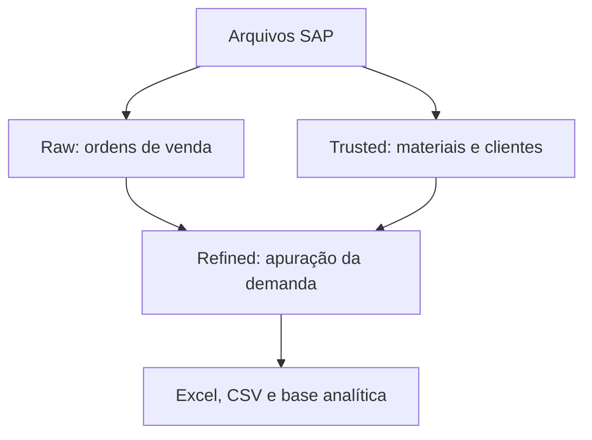

# Honda Demand Analytics — Databricks

Pipeline de dados para ingestão, enriquecimento, apuração e exportação da
demanda de peças da Honda no Azure Databricks.

- **Área responsável:** Demand Planning — Honda Parts Division
- **Plataforma:** Azure Databricks
- **Armazenamento:** Delta Lake e Unity Catalog
- **Catálogo atual:** `parts_hdbk_sandbox`

## Objetivo

O projeto consolida ordens de venda do SAP com cadastros de materiais e
clientes para produzir bases históricas de demanda destinadas ao planejamento.

O fluxo cobre:

- ingestão incremental de ordens de venda;
- tratamento e histórico do cadastro de materiais;
- enriquecimento com cadeia de substituição e dados de clientes;
- apuração da demanda por segmento, mercado e centro de distribuição;
- geração de base analítica;
- exportação para CSV e Excel.

## Arquitetura

As camadas lógicas seguem o fluxo Raw → Trusted → Refined. Os nomes físicos dos
schemas são preservados conforme a estrutura existente do workspace.



### Principais objetos

| Camada lógica | Schema ou objeto | Conteúdo |
| --- | --- | --- |
| Raw | `dt_sales_orders.raw_sales_order` | Ordens de venda do SAP |
| Trusted | `pr_cadastrao.material_cadastrao` | Cadastro atual de materiais |
| Trusted | `pr_cadastrao.material_inventory_history` | Snapshots mensais de estoque |
| Trusted | `pr_cadastrao.material_spec_changes` | Histórico SCD2 dos campos técnicos por empresa e material |
| Trusted | `pr_cadastrao.material_cadeia` | Item principal da cadeia de materiais |
| Trusted | `dm_customers.knvv_sap` | Atributos comerciais dos clientes |
| Trusted | `dm_customers.kna1_sap` | Dados gerais dos clientes |
| Refined | `pr_demand.refined_demand_*` | Visões consolidadas de demanda |
| Refined | `_agents_databases.demand_analytical_base` | Base analítica por item da ordem |

## Estrutura do repositório

```text
honda-demand-databricks/
├── 01_Demand/                     # Pipeline ativo de demanda
│   └── notebook_architecture_standards.md
├── skills/
│   └── arquiteto-de-dados/        # Instruções de arquitetura do projeto
└── README.md
```

Os domínios `02_CadFechamento`, `03_Baseline` e `04_Forecast` fazem parte da
evolução planejada, mas ainda não possuem implementação neste repositório.

## Notebooks

### Entrada e ordens de venda

| Notebook | Função | Modo |
| --- | --- | --- |
| `1.0_receive_and_move_files` | Direciona arquivos recebidos conforme o prefixo | Sob demanda |
| `1.1_ingest_raw_sales_order` | Mantém `raw_sales_order` via Auto Loader e MERGE | Incremental |
| `99_ingest_raw_sales_order_historical` | Inicializa a RAW a partir do histórico Parquet | Bootstrap excepcional |
| `99_nb_sales_order_support_functions` | Remove manualmente um período para reprocessamento | Manutenção ad hoc |

### Materiais e clientes

| Notebook | Função | Saída principal |
| --- | --- | --- |
| `2.1_ingest_refined_material_cadastrao` | Consolida o cadastro atual de materiais | `material_cadastrao` |
| `2.2_ingest_refined_material_stock_snapshot` | Registra o snapshot mensal de estoque e preço | `material_inventory_history` |
| `2.3_ingest_refined_material_historical` | Mantém o histórico SCD Type 2 dos campos técnicos | `material_spec_changes` |
| `3.1_ingest_refined_material_cadeia` | Define o item principal da cadeia | `material_cadeia` |
| `4.1_ingest_customer_knvv_sap` | Consolida atributos comerciais de clientes | `knvv_sap` |
| `4.2_ingest_customer_kna1_sap` | Consolida dados gerais de clientes | `kna1_sap` |

### Processamento e saída

| Notebook | Função | Situação |
| --- | --- | --- |
| `5.1_refined_demanda_fechamento` | Produz as tabelas `refined_demand_*` | Principal |
| `5.2_demand_analytical_base` | Produz a base analítica unificada | Opcional |
| `6.1_export_demand_to_csv` | Exporta tabelas para CSV | Alternativo |
| `6.2_export_demand_to_xlsx_v2` | Gera workbooks Excel com múltiplas abas | Recomendado |
| `6.2_export_demand_to_xlsx` | Exportador Excel anterior | Legado |
| `7.1_zip_exported_demand_files` | Compacta os arquivos de saída | Opcional |

## Ordem de execução

### Primeira implantação

Execute uma única vez para criar a tabela histórica de ordens de venda:

```text
99_ingest_raw_sales_order_historical
```

Depois utilize o fluxo recorrente.

### Fluxo recorrente

```text
1.0_receive_and_move_files             # Quando houver arquivos no orquestrador
1.1_ingest_raw_sales_order             # Ordens de venda incrementais

2.1_ingest_refined_material_cadastrao  # Cadastro atual
2.2_ingest_refined_material_stock_snapshot
2.3_ingest_refined_material_historical # Executar após 2.2
3.1_ingest_refined_material_cadeia
4.1_ingest_customer_knvv_sap
4.2_ingest_customer_kna1_sap

5.1_refined_demanda_fechamento
5.2_demand_analytical_base             # Opcional

6.2_export_demand_to_xlsx_v2           # Exportação recomendada
7.1_zip_exported_demand_files          # Opcional
```

Em um job automatizado, as dependências devem impedir a execução das etapas de
processamento quando uma carga anterior falhar.

## Configurações principais

As configurações estão atualmente declaradas nos próprios notebooks.

```python
JANELA_MESES = 60
JANELA_MESES_ZPUG_CLI = 12
```

| Código | Significado |
| --- | --- |
| Organização `0200` | HDA — 2W |
| Organização `0500` | HAB — 4W |
| Canal `01` | Mercado interno |
| Canal `02` | Mercado externo |

### Centros de distribuição

| Segmento | Centros |
| --- | --- |
| HDA — 2W | `0203`, `0209`, `0232` |
| HAB — 4W | `0503`, `0505` |
| Consolidado | `TTL` |

## Visões de demanda

| Visão | Definição resumida |
| --- | --- |
| Fechada | Quantidade agrupada pelo item principal da cadeia |
| Fechada sem ZESP | Demanda fechada excluindo pedidos `ZESP` |
| Aberta | Quantidade preservada no material original |
| Linha | Contagem de linhas pelo item principal da cadeia |
| MI | Demanda do canal de mercado interno |
| ME | Demanda do canal de mercado externo |
| ME sem ZESP | Mercado externo excluindo pedidos `ZESP` |
| ZPUG | Pedidos urgentes de garantia |
| ZPUG por cliente | Pedidos ZPUG detalhados pelo emissor da ordem |
| Distribuição | Demanda por centro e canal de vendas |

## Padrão dos notebooks

Cada notebook começa com uma célula Markdown curta contendo:

- propósito;
- entradas;
- saídas;
- chave ou granularidade;
- modo ou frequência da carga.

O cabeçalho é estático: não importa módulos, não imprime documentação e não
interfere na execução. Regras detalhadas permanecem próximas ao código que as
implementa.

Consulte o documento
[`01_Demand/notebook_architecture_standards.md`](01_Demand/notebook_architecture_standards.md)
para o padrão completo e o checklist.

## Uso de recursos

Para reduzir consumo e esforço operacional:

- evite `display()` em jobs automáticos;
- não repita `count()` sobre o mesmo DataFrame sem necessidade;
- limite operações que coletam dados no driver, como `toPandas()`;
- prefira logs curtos de início, resultado e falha;
- instale dependências antes de criar estado no notebook;
- mantenha parâmetros operacionais agrupados;
- use o exportador Excel v2 para o fluxo atual.

## Pré-requisitos

- workspace Azure Databricks com Unity Catalog;
- acesso ao catálogo `parts_hdbk_sandbox`;
- leitura nos schemas de origem;
- criação e modificação nas tabelas de destino;
- acesso aos volumes usados pelas ingestões e exportações.

## Manutenção

O Git é a fonte oficial do histórico de alterações. O README descreve o estado
atual do pipeline e não mantém um changelog duplicado.

- **Responsável:** André Causs — Demand Planning
- **Uso:** Interno — Honda Parts Division
